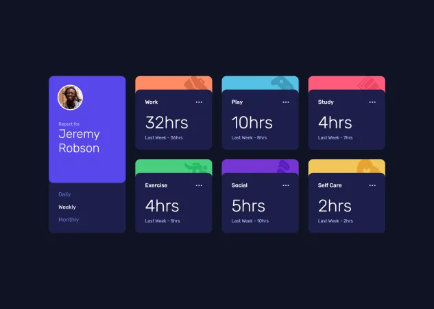

# Frontend Mentor - Time tracking dashboard solution

This is a solution to the [Time tracking dashboard challenge on Frontend Mentor](https://www.frontendmentor.io/challenges/time-tracking-dashboard-UIQ7167Jw). Frontend Mentor challenges help you improve your coding skills by building realistic projects.

### The challenge

Users should be able to:

- View the optimal layout for the site depending on their device's screen size
- See hover states for all interactive elements on the page
- Switch between viewing Daily, Weekly, and Monthly stats

### Screenshot

Desktop



Tablet


Mobile


### Links

- Solution URL:
- Live Site URL:

## My process

### Built with

- Semantic HTML5 markup
- Flexbox
- CSS Grid
- Mobile-first workflow
- [Sass (Dart Sass)](https://sass-lang.com/)
- [BEM](https://getbem.com/)
- JS

### CSS build

Install [Dart Sass](https://sass-lang.com/install/#install-standalone) or Sass (one-time):

```
npm install -g sass
```

Dev:

```
sass --watch scss:dist
```

Build:

```
sass scss:dist
```
